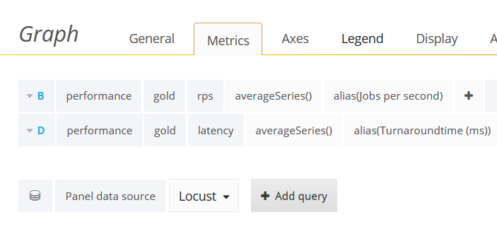
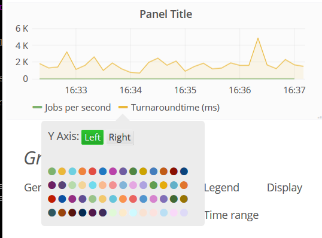
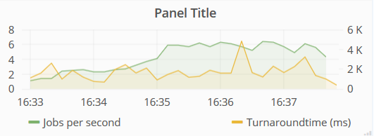
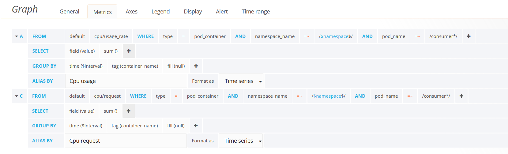
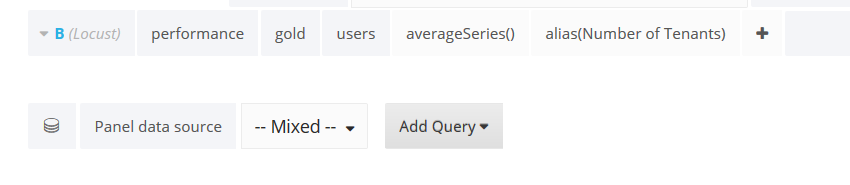
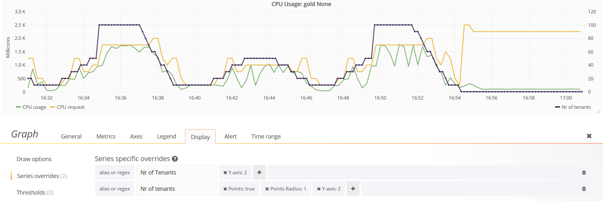
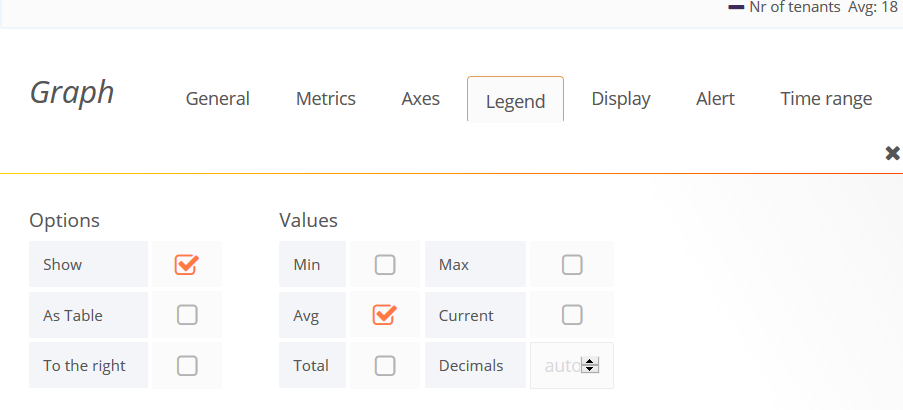

#Prerequisites

Given the following cluster setup 
```
$ kubectl get nodes --show-labels
k8-test-1   Ready    master   56d   v1.14.1   beta.kubernetes.io/arch=amd64,beta.kubernetes.io/os=linux,kubernetes.io/arch=amd64,kubernetes.io/hostname=k8-test-1,kubernetes.io/os=linux,node-role.kubernetes.io/master=
k8-test-2   Ready    <none>   56d   v1.14.1   beta.kubernetes.io/arch=amd64,beta.kubernetes.io/os=linux,kubernetes.io/arch=amd64,kubernetes.io/hostname=k8-test-2,kubernetes.io/os=linux,monitoringNode=yes,workerNode=yes
k8-test-3   Ready    <none>   56d   v1.14.1   beta.kubernetes.io/arch=amd64,beta.kubernetes.io/os=linux,kubernetes.io/arch=amd64,kubernetes.io/hostname=k8-test-3,kubernetes.io/os=linux,
```

Note the following node labels:
* On the monitoringNode heapster, grafana, influxdb and graphite are deployed
* On the workerNode the scaler-controller chart is deployed

# Install locust on the master using pip3

pip3 requires python3

```
$ pip3 install locust
```

Add locust to your PATH by adding the following line to your .bashrc or .bash_profile file

```
export PATH=$PATH:$HOME/.local/bin
```

# Install helm

```bash
# Install Helm client, 
$ curl -LO https://kubernetes-helm.storage.googleapis.com/helm-v2.8.0-linux-amd64.tar.gz && tar xvzf helm-v2.8.0-linux-amd64.tar.gz && chmod +x ./linux-amd64/helm && sudo mv ./linux-amd64/helm /usr/local/bin/helm
```

To install helm in distributed cluster, you'll first need to first create a [service-account for Helm](http://jayunit100.blogspot.be/2017/07/helm-on.html) and initiate helm with this service account. Short, you have to execute the following commands


```
$ kubectl create -f helm.yaml
$ helm init --service-account helm
``` 

# Install the python-based application

```
#install golden SLA-class
$ helm install charts/exp2app

#install bronzen SLA-class
$ helm install charts/bronze
```

# Install the scaler

```
helm install charts/scaler-controller

```
Set the appropriate matrix in the resource planner pod

```
$ kubectl get pods -n scaler
NAME                              READY   STATUS    RESTARTS   AGE
go-deployer-58bb7c4c49-tg5c9      1/1     Running   6          61m
rabbitmq-7b944bfdf4-wsltc         1/1     Running   0          61m
resource-planner-589d79bf-sh6pp   1/1     Running   0          61m
$ kubectl exec -it resource-planner-589d79bf-sh6pp -n scaler -- sh
/ # vi server.py
```

Edit in server.py the following line
```
config_data = yaml.safe_load(open('data/matrix.yaml'))^M
```
`/data/matrix.yaml` is the matrix for heterogeneous scaling, while `/data/single-replica.yaml` is for homogeneous scaling. The values in the matrix have been determined for the workload sent out in the workload-generator app


# Install graphite

```
$ helm install charts/graphite --name graphite
```
It logs the results of the experiments. To push metrics, two different endpoints are available, one for discrete data and the other for aggregated data.

In order for graphite to store the results it expects a directory `Results` at the current directory.


# Install Heapster, Grafana and InfluxDB

```
$ helm install charts/heapster-grafana-influxdb --name heapster
```

To display graphite metrics on Grafana dashboard, log into the dashboard and [add graphite as data source](https://grafana.com/docs/grafana/latest/features/datasources/graphite/). This deployment does not implement any persistance mechanism, so all data is going to be lost on cluster failure. [Persistent Volumes](https://kubernetes.io/docs/concepts/storage/persistent-volumes/)
can be used to avoid this (see charts/graphite/templates/volume.yaml)


# Start the locust server

Edit `Locust/locustfile-exp1.py' to replace the IP of the queue host on the HttpLocust class for your queue endpoint. For generating local files with throughput and turnaround time, Locust/locustfile-exp.py can be used instead. In both cases, the socket connection (self.sock.connect(IP, port)) needs to match the graphite aggregator service (running by default on nodePort 30688).


```
$cd Locust
# In order for graphite to store the results it expects a directory `Results` at the current directory.
$mkdir Results
$locust -f locustfile-exp.py
[2020-03-19 17:58:18,258] k8-test-1/INFO/locust.main: Starting web monitor at http://*:8089
[2020-03-19 17:58:18,259] k8-test-1/INFO/locust.main: Starting Locust 0.14.5
```

Open browser at `http://ip of locust node:8089` and check Locust is up. 


# To get metrics of the locust test into the graphite server ...
instead of a local `Results` directory:
 * Update the IP-address of the Locust service and the graphite service in `metrics.py`
 * Run in a separate terminal run:

```
cd ../apps/workload-generator
python3 metrics.py
```

This script is going to fetch metrics from the current run using the Locust API and push them to the graphite host. Modify the SLA class and graphite endpoint if needed.


## Troubleshooting missing modules in metrics.py
Note metrics.py requires the aiohttp module that is not supported anymore in python3.5. This gives problems if the Locust program is installed for python3.5.
The solution is to use virtual environments.

First check your python3 version

```
readlink -f $(which python3) | xargs -I % sh -c 'echo -n "%: "; % -V'
```
If the installed python version is 3.5 or less, install python3.6:

```
sudo apt update
sudo apt install software-properties-common
sudo add-apt-repository ppa:deadsnakes/ppa  
sudo apt update
sudo apt install python3.6

```

Then install a separate pip3 version in a virtual environement:
```
#in directory apps/workload-generator
python3.6 -m venv env --without-pip
source env/bin/activate
curl https://bootstrap.pypa.io/get-pip.py | python3.6
pip3 install aiohttp
python3 metrics.py
```


# Start the workload generator
First modify the IP address of the master node in apps/workload-generator/generator.py

```
cd ../apps/workload-generator
python3 generator.py start -f thesis/seasonal.yaml --host=http://172.17.13.106:8089
```

The above tests a seasonal workload.


# Visualize the Graphite metrics in Grafana

## Prerequisites
* You have started locust with the file [Locust/locustfile-exp1.py](Locust/locustfile-exp1.py).

* You have [added graphite as a data source](https://grafana.com/docs/grafana/latest/features/datasources/graphite/). Just replace localhost with the ClusterIP of the graphite service, and select the Proxy mechanism.

The metrics of graphite are available under performance.gold


## User flow

* Open grafana in your browser at nodeport 30345
* Left-Click on the Graphite Carbon Metrics Dashboard
* Left-Click on the one of the Panels or add a new Panel
* Left-Click on the Edit menu
* The Metrics menu appears
* Remove any metrics 
* Choose as Panel data source: Locust
* Left click add query
* Add the following queries: 
* The metrics need to be displayed at different scales. To do this, click in Legend of the planel on the colored line besides the metric that needs to move to the right Y-axis:  


* Go to the Pods dashboard, but first save the changes to the GraphiteMetrics dashboard
* Go to the gold namespace of the CPU usage panel
* Adapt the Metrics of the CPU panel as follows: 
* Select the mixed datasource to add the number of users as follows: 
* Move the number of tenants metrics to the right Y-axis as above: ![Y-axis-3](images/Y-axis-3.png]
* Use the Display menu to customize the printing of the lines: 
* Use the Legends menu to add averages to the legend's items: 


More information:
* https://grafana.com/docs/grafana/latest/features/panels/graph/
* https://community.grafana.com/t/consolidate-data-from-multiple-datasources-sites-on-same-graph-panel/2496/2
* https://community.grafana.com/t/can-i-have-two-different-units-for-y-axis/696
* https://community.grafana.com/t/getting-line-connected-points-over-a-series/164


